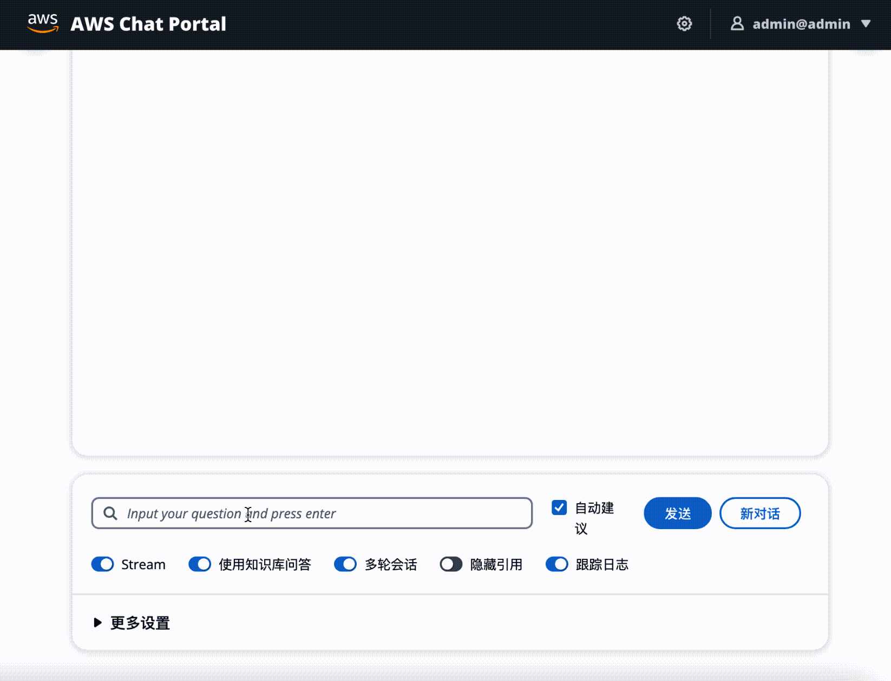
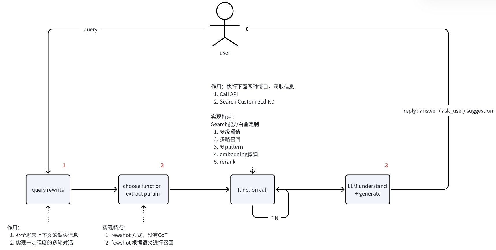

<p align="left">
    &nbsp中文&nbsp ｜ <a href="README_EN.md">English</a>&nbsp 
</p>
<br>

## 基本介绍

一个基于AWS服务和LangChain框架的生产级知识问答chatbot实现, 对各个环节进行了优化。支持向量模型 & 大语言模型的灵活配置插拔。前后端分离，易集成到IM工具(如飞书)。 

 

<br>

## 如何部署这个方案？

- 部署文档
  + [飞书](https://upgt6k0dbo.feishu.cn/docx/GiLZd1glmo0l06xNRDmcr4P1nBf)
- Workshop(step-by-step)
  + [workshop地址](https://catalog.us-east-1.prod.workshops.aws/workshops/158a2497-7cbe-4ba4-8bee-2307cb01c08a/zh-CN) *（注意：部署需参考飞书文档，workshop中部署的为一个不更新的branch，主要帮助不熟悉AWS的用户更容易的上手）*

<br>

## 如何快速了解这个方案？

- **基础设施架构图**

	
	

<br>

- **工作流程图**
  
    一般来说全流程需要进行三次大语言模型调用，在下图上用红色数字标注了序号。
    
    
    

<br>
    
- **代码介绍**
  
    需重点关注code/, deploy/, docs/, notebooks/ 这四个目录，code/目录中按照模块拆分了7个子目录，deploy/用于设定cdk部署资源的，docs/提供了知识/fewshot文件范例, notebooks/中提供了各类模型部署/微调/可视化的一些notebook文件，帮助你更深入的优化效果。
    
    ```shell
    .
    ├── Agent_Pydantic_Lambda                # Agent API实现范例(submodule)
    ├── chatbotFE                            # 前端代码(submodule)
    ├── code
    │   ├── main/                            # 主逻辑对应的lambda代码目录
    │   ├── offline_process/                 # 离线知识构建对应的执行代码目录
    │   ├── lambda_offline_trigger/          # 启动离线知识摄入的lambda代码目录
    │   ├── lambda_plugins_trigger/          # 暂不使用
    │   ├── intention_detect/                # 意图识别lambda代码目录
    │   ├── query_rewriter/                  # 用户输入重写lambda代码目录
    │   └── chat_agent/                      # 调用API的模块
    ├── deploy
    │   ├── lib/                             # cdk 部署脚本目录
    │   └── gen_env.sh                       # 自动生成部署变量的脚本(for workshop)
    ├── docs
    │   ├── intentions/                      # 意图识别的示例标注文件
    │   ├── prompt_template/                 # 经过测试的Prompt模版  
    │   ├── aws_cleanroom.faq                # faq 知识库文件
    │   ├── aws_msk.faq                      # faq 知识库文件
    │   ├── aws_emr.faq                      # faq 知识库文件
    │   ├── aws-overview.pdf                 # pdf 知识库文件
    │   └── PMC10004510.txt                  # txt 纯文本文件
    ├── doc_preprocess/                      # 原始文件处理脚本
    │   ├── pdf_spliter.py                   # pdf解析拆分脚本      
    │   └── ...                  
    ├── notebook/                            # 各类notebook
    │   ├── embedding/                       # 部署embedding模型的notebook
    │   ├── llm/                             # 部署LLM模型的notebook
    │   ├── mutilmodal/                      # 部署多模态模型的notebook，包括VisualGLM
    │   ├── guidance/                        # 向量模型微调及效果可视化的若干notebook                         
    │   └── ...     
    ```

<br>

## 常见问题

**Q1:** 如何适配到自己的业务环境？

**A1:**  参考下面三步：

- 上传自己的文档。

- 上传自己的fewshot文件(参考/docs/intentions/目录), 实现定制的意图分流.

- 对接到自己的前端，后端API如何调用请参考 [后端API接口](./backend_interface.md)。


**Q2:** 知识召回错误率高如何优化？RAG的最佳实践在那？

**A2:** 参考[最佳实践](./best_practice_summary.pdf)

**Q3:** 支持导入哪些数据格式？

**A3:** 目前支持pdf，word, txt, md, wiki 等文本格式的导入，对于FAQ形式的数据，本方案做了针对性的召回优化，可以参考docs/下面的集中FAQ格式(.faq, .csv, .xlsx)。

**Q4:** 基础设施的费用如何？

**A4:** 由于生产环境的数据和并发，仅仅基于测试环境给出一些数据供参考。整个方案大部份属于serverless架构，大部份服务组件(Bedrock, Glue, Lambda等)按照用量进行付费，在我们之前的经验中，大部份服务费用占比很低。其中SageMaker, OpenSearch的费用占比较高(90%+),  SageMaker在海外是optional的，如果不需要部署独立的rerank模型，则不需要。OpenSearch的费用跟机型相关，具体参考 https://aws.amazon.com/cn/opensearch-service/pricing/，方案中默认的机型2 * r6g.large.search的费用是USD 0.167/hour，可以相应的调整机型降低费用。

<br>

## 注意事项

1. 构建向量索引时需要注意什么？
   + 需要考虑knn_vector's dimension与向量模型输出纬度对齐，space_type 与向量模型支持的类型对齐
   
   + 用户需要根据数据量自行决定是否开启ANN索引, 即("knn": "true")
   
   + m, ef_consturtion 参数需要根据根据数据量进行调整
   

<br>

## 交流&获取帮助

- 加入微信群<br>
  

<br>

## 更多Demo视频

- [完整版 - bilibili](https://www.bilibili.com/video/BV1HN4y1D7vy/?vd_source=2cb87d8dd3ca4ea778f5468be12405b3)
- [简短版 - bilibili](https://www.bilibili.com/video/BV1KW4y1P7yR/?spm_id_from=333.999.0.0&vd_source=511a28c6a49e890567f0de77abde6e02)
- [飞书版 - bilibili](https://www.bilibili.com/video/BV15T4y1h7th/?vd_source=511a28c6a49e890567f0de77abde6e02)
