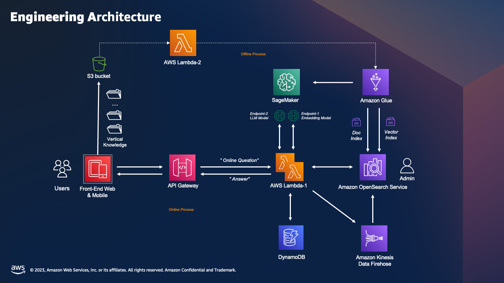

### 私域知识问答

- 系统架构
  

- 前端界面
  
  
  
- 部署方式
  - 参考 [workshop](https://catalog.us-east-1.prod.workshops.aws/workshops/158a2497-7cbe-4ba4-8bee-2307cb01c08a/en-US)
  - 构建向量索引时的注意事项:
      + 需要考虑knn_vector's dimension与向量模型输出纬度对齐，space_type 与向量模型支持的类型对齐
      + 用户需要根据数据量自行决定是否开启ANN索引, 即("knn": "true")
      + m, ef_consturtion 参数需要根据根据数据量进行调整

- 代码介绍

  ```python
  .
  ├── code
  │   ├── main/                            # 主逻辑对应的lambda代码目录
  │   ├── offline_process/                 # 离线知识构建对应的执行代码目录
  │   ├── lambda_offline_trigger/          # 启动离线知识摄入的lambda代码目录
  │   ├── lambda_plugins_trigger/          # 暂不使用
  │   ├── intention_detect/                # 意图识别lambda代码目录
  │   └── query_rewriter/                  # 用户输入重写lambda代码目录
  ├── deploy
  │   ├── lib/                             # cdk 部署脚本目录
  │   └── gen_env.sh                       # 自动生成部署变量的脚本(for workshop)
  ├── docs
  │   ├── intentions/                      # 意图识别的示例标注文件
  │   ├── aws_cleanroom.faq                # faq 知识库文件
  │   ├── aws_msk.faq                      # faq 知识库文件
  │   ├── aws_emr.faq                      # faq 知识库文件
  │   ├── aws-overview.pdf                 # pdf 知识库文件
  │   └── PMC10004510.txt                  # txt 纯文本文件
  ├── doc_preprocess/                      # 原始文件处理脚本
  │   ├── pdf_spliter.py                   # pdf解析拆分脚本      
  │   └── ...                  
  ├── notebook/                            # 各类notebook
  │   ├── embedding/                       # 部署embedding模型的notebook，包括bge, paraphrase-multilingual, 以及finetune embedding模型的脚本    
  │   ├── llm/                             # 部署LLM模型的notebook，包括chatglm2, qwen, buffer-instruct-baichuan-001
  │   ├── mutilmodal/                      # 部署多模态模型的notebook，包括VisualGLM
  │   ├── guidance/                        # 向量模型微调及效果可视化的若干notebook                         
  │   └── ...     
  ```

- 流程介绍

  - 离线流程
    - a1. 前端界面上传文档到S3
    - a2. S3触发Lambda开启Glue处理流程，进行内容的embedding，并入库到AOS中
    - b1. 把cloud watch中的日志通过KDF写入到AOS中，供维护迭代使用
  - 在线流程[网页](http://chatbotfe-1170248869.us-west-2.elb.amazonaws.com/chat#)
    - a1. 前端界面发起聊天，调用AIGateway，通过Dynamodb获取session信息
    - a2. 通过lambda访问 Sagemaker Endpoint对用户输入进行向量化
    - a3. 通过AOS进行向量相似检索
    - a4. 通过AOS进行倒排检索，与向量检索结果融合，构建Prompt
    - a5. 调用LLM生成结果 
    - 前端[网页](http://chatbotfe-1170248869.us-west-2.elb.amazonaws.com/chat#)切换模型

- 知识库构建
  
  + 构建Opensearch Index
    其中**doc_type**可以为以下四个值**['Question','Paragraph','Sentence','Abstract']**
    注意："dimension": 768 这个参数需要根据实际使用的向量模型输出纬度进行修改  
    ```shell
    PUT chatbot-index
    {
        "settings" : {
            "index":{
                "number_of_shards" : 1,
                "number_of_replicas" : 0,
                "knn": "true",
                "knn.algo_param.ef_search": 32
            }
        },
        "mappings": {
            "properties": {
                "publish_date" : {
                    "type": "date",
                    "format": "yyyy-MM-dd HH:mm:ss"
                },
                "idx" : {
                    "type": "integer"
                },
                "doc_type" : {
                    "type" : "keyword"
                },
                "doc": {
                    "type": "text",
                    "analyzer": "ik_max_word",
                    "search_analyzer": "ik_smart"
                },
                "content": {
                    "type": "text",
                    "analyzer": "ik_max_word",
                    "search_analyzer": "ik_smart"
                },
                "doc_title": {
                    "type": "keyword"
                },
                "doc_author": {
                    "type": "keyword"
                },
                "doc_category": {
                    "type": "keyword"
                },
                "embedding": {
                    "type": "knn_vector",
                    "dimension": 768,
                    "method": {
                        "name": "hnsw",
                        "space_type": "cosinesimil",
                        "engine": "nmslib",
                        "parameters": {
                            "ef_construction": 512,
                            "m": 32
                        }
                    }            
                }
            }
        }
    }
    ```

- Demo视频：  
https://www.bilibili.com/video/BV1HN4y1D7vy/?vd_source=2cb87d8dd3ca4ea778f5468be12405b3

- 安装部署文档：   
https://upgt6k0dbo.feishu.cn/docx/S56udzGrrodzLHxl9YdcRq91nrd  
