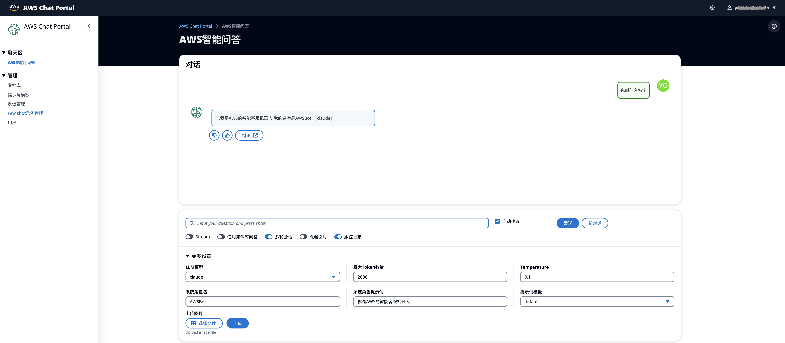
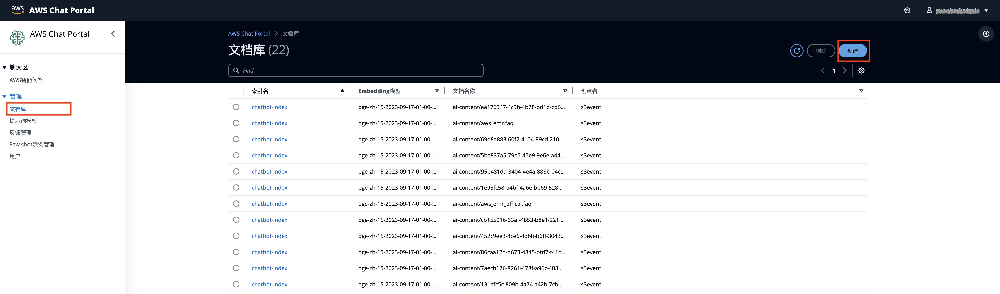

### 私域知识问答机器人

- 基本介绍
  
  基于AWS服务和大语言模型的知识问答Chatbot项目，支持大语言模型和向量模型的灵活插拔，可支持开源模型私有化部署或者bedrock Claude以及其他商业模型。
  
- 常见问题
  
  知识召回错误率高？LLM的幻觉严重？文档量大写入管理遇到问题？
  
  参考PDF - [最佳实践](https://github.com/aws-samples/private-llm-qa-bot/blob/main/best_practice_summary.pdf)
  
- 效果展示
  
  - 前端界面(前后端分离, 前端仅提供功能展示)
  
    
  
  - Demo效果
  
    https://www.bilibili.com/video/BV1HN4y1D7vy/?vd_source=2cb87d8dd3ca4ea778f5468be12405b3
  
- 部署方式
  
  - 部署文档 
    - [PDF版本](https://github.com/aws-samples/private-llm-qa-bot/blob/main/Deployment%20Guide.pdf)
    - [飞书版本](https://upgt6k0dbo.feishu.cn/docx/S56udzGrrodzLHxl9YdcRq91nrd)
  - 构建向量索引时的注意事项:
    + 需要考虑knn_vector's dimension与向量模型输出纬度对齐，space_type 与向量模型支持的类型对齐
    + 用户需要根据数据量自行决定是否开启ANN索引, 即("knn": "true")
    + m, ef_consturtion 参数需要根据根据数据量进行调整
  - 相关workshop地址 [workshop](https://catalog.us-east-1.prod.workshops.aws/workshops/158a2497-7cbe-4ba4-8bee-2307cb01c08a/en-US)
  
- 代码 & 架构

  - 架构图
    
  - 代码结构
    
    ```shell
    .
    ├── code
    │   ├── main/                            # 主逻辑对应的lambda代码目录
    │   ├── offline_process/                 # 离线知识构建对应的执行代码目录
    │   ├── lambda_offline_trigger/          # 启动离线知识摄入的lambda代码目录
    │   ├── lambda_plugins_trigger/          # 暂不使用
    │   ├── intention_detect/                # 意图识别lambda代码目录
    │   └── query_rewriter/                  # 用户输入重写lambda代码目录
    ├── deploy
    │   ├── lib/                             # cdk 部署脚本目录
    │   └── gen_env.sh                       # 自动生成部署变量的脚本(for workshop)
    ├── docs
    │   ├── intentions/                      # 意图识别的示例标注文件
    │   ├── prompt_template/                 # 经过测试的Prompt模版  
    │   ├── aws_cleanroom.faq                # faq 知识库文件
    │   ├── aws_msk.faq                      # faq 知识库文件
    │   ├── aws_emr.faq                      # faq 知识库文件
    │   ├── aws-overview.pdf                 # pdf 知识库文件
    │   └── PMC10004510.txt                  # txt 纯文本文件
    ├── doc_preprocess/                      # 原始文件处理脚本
    │   ├── pdf_spliter.py                   # pdf解析拆分脚本      
    │   └── ...                  
    ├── notebook/                            # 各类notebook
    │   ├── embedding/                       # 部署embedding模型的notebook
    │   ├── llm/                             # 部署LLM模型的notebook
    │   ├── mutilmodal/                      # 部署多模态模型的notebook，包括VisualGLM
    │   ├── guidance/                        # 向量模型微调及效果可视化的若干notebook                         
    │   └── ...     
    ```

- API访问接口
  
  【注意】Apigateway endpoint可以从后端部署后的cloudformation outputs里获得key=APIgatewayendpointurl  
  
  - Chat接口(POST方法)
    ```json
      {
        "msgid": "类型string, 用于标识本次message id",
        "chat_name": "类型string, 用于标识本次会话的session id",
        "prompt":"类型string,用户的问题",
        "use_qa": "类型Bool,是否使用知识库问答",
        "multi_rounds":  "类型Bool,是否开启多轮会话",
        "hide_ref": "类型Bool,回复中是否隐藏引用文档",
        "system_role": "类型string,定义bot的扮演角色，可为空",
        "system_role_prompt": "类型string,系统提示词，可为空",
        "max_tokens": 2000,
        "temperature": 0.01,
        "use_trace": "类型Bool,是否开启调试追踪",
        "model_name": "模型名，如claude",
        "template_id": "类型string, prompt模板id，默认使用default",
        "username": "类型string，用户名称",
      }
    ```
    examples:
    ```bash
    curl -X POST -H "Content-Type: application/json" -d '{"msgid": "id-1699868804605-a4e9b6110d998_res",
      "chat_name": "OVJ9beqoPHcCEgA=",
      "prompt": "hello",
      "system_role": "",
      "use_qa": "False",
      "multi_rounds": "True",
      "hide_ref": "False",
      "system_role_prompt": "",
      "obj_prefix": "ai-content/",
      "use_stream": "True",
      "max_tokens": 8000,
      "temperature": 0.01,
      "use_trace": "False",
      "model_name": "claude",
      "template_id": "default",
      "username": "admin"}' https://xxxxx.execute-api.us-west-2.amazonaws.com/prod
    ```
  - 知识管理接口(POST方法)
    ```json
      {
        "method": "delete-删除,get-列出所有文档,",
        "resource": "docs",
        "filename": "类型string，上传文档名称",
        "embedding_model": "embedding模型endpoint",
        "index_name":"AOS 的索引名称"
      }
    ```
    examples:
    ```bash
    curl -X POST -H "Content-Type: application/json" -d '{"method":"get","resource":"docs"}'  https://xxxxxx.execute-api.us-west-2.amazonaws.com/prod
    ```
  - prompt模板管理接口  
  
    ```json
      {
        "method": "delete-删除,get-列出所有,post-新增或者保存",
        "resource": "template",
        "body":{
            "id": "类型string，模板id, 删除和新增操作需要",
            "template_name": "类型string，模板名称，新增或者保存操作需要",
            "template":"类型string，模板类容，新增或者保存操作需要",
            "comment":"类型string，模板备注",
            "username":"类型string，创建者名称"
        }
      }
    ```
     examples:
      ```bash
      curl -X POST -H "Content-Type: application/json" -d '{"method":"get","resource":"docs"}'  https://xxxxxx.execute-api.us-west-2.amazonaws.com/prod
      ```
  - feedback管理接口(post方法)
    ```json
    {
      "method": "delete-删除,get-列出所有,post-新增",
      "resource": "feedback",
      "body":{
          "session_id": "类型string，会话id，删除或者新增操作需要",
          "msgid":  "类型string, 用于标识本次message id，删除或者新增操作需要",
          "action":"类型string，thumb-up,thumb-down,new-added,injected",
          "timestamp":"类型string，时间戳",
          "username":"类型string，反馈者名称",
          "feedback":"类型string，反馈的内容",
          "question": "类型string，反馈的原始问题",
          "answer": "类型string，反馈的原始答案",
          "pagesize":"类型int, 查询的page大小，get操作需要 "
      }
    }
    ```
  
- 流程介绍

  - 离线流程
    - a1. 前端界面上传文档到S3
    - a2. S3触发Lambda开启Glue处理流程，进行内容的embedding，并入库到AOS中
    - b1. 把cloud watch中的日志通过KDF写入到AOS中，供维护迭代使用
  - 在线流程[网页](http://chatbot-817094994.us-west-2.elb.amazonaws.com/chat#)
    - a1. 前端界面发起聊天，调用AIGateway，通过Dynamodb获取session信息
    - a2. 通过lambda访问 Sagemaker Endpoint对用户输入进行向量化
    - a3. 通过AOS进行向量相似检索
    - a4. 通过AOS进行倒排检索，与向量检索结果融合，构建Prompt
    - a5. 调用LLM生成结果 
    - 前端[网页](http://chatbot-817094994.us-west-2.elb.amazonaws.com/chat#)切换模型

  

- 知识库构建

  参考[README.md](https://github.com/aws-samples/private-llm-qa-bot/blob/main/code/offline_process/aos_schema.md)构建知识库, 构建了知识库以后才能导入知识文件。构建完毕后，可以从前端页面导入知识。导入成功以后，能够在文档库中找到对应的知识文件
  

  + 构建Opensearch Index
    其中**doc_type**可以为以下四个值**['Question','Paragraph','Sentence','Abstract']**
    注意："dimension": 768 这个参数需要根据实际使用的向量模型输出纬度进行修改  
    ```shell
    PUT chatbot-index
    {
        "settings" : {
            "index":{
                "number_of_shards" : 1,
                "number_of_replicas" : 0,
                "knn": "true",
                "knn.algo_param.ef_search": 32
            }
        },
        "mappings": {
            "properties": {
                "publish_date" : {
                    "type": "date",
                    "format": "yyyy-MM-dd HH:mm:ss"
                },
                "idx" : {
                    "type": "integer"
                },
                "doc_type" : {
                    "type" : "keyword"
                },
                "doc": {
                    "type": "text",
                    "analyzer": "ik_max_word",
                    "search_analyzer": "ik_smart"
                },
                "content": {
                    "type": "text",
                    "analyzer": "ik_max_word",
                    "search_analyzer": "ik_smart"
                },
                "doc_title": {
                    "type": "keyword"
                },
                "doc_author": {
                    "type": "keyword"
                },
                "doc_category": {
                    "type": "keyword"
                },
                "embedding": {
                    "type": "knn_vector",
                    "dimension": 768,
                    "method": {
                        "name": "hnsw",
                        "space_type": "cosinesimil",
                        "engine": "nmslib",
                        "parameters": {
                            "ef_construction": 512,
                            "m": 32
                        }
                    }            
                }
            }
        }
    }
    ```
