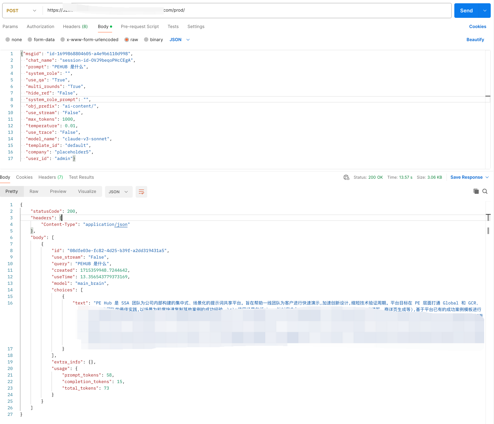
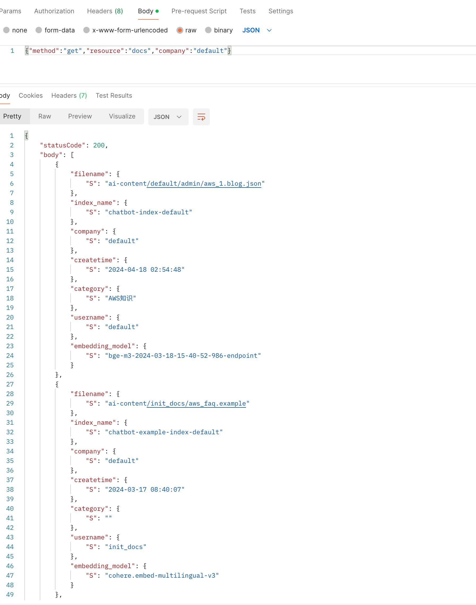

## API访问接口
  
  【注意】Apigateway endpoint可以从后端部署后的cloudformation outputs里获得key=APIgatewayendpointurl  
  
  - Chat接口(POST方法)
    ```json
      {
        "msgid": "类型string, 用于标识本次message id",
        "chat_name": "类型string, 用于标识本次会话的session id",
        "prompt":"类型string,用户的问题",
        "use_qa": "类型Bool,是否使用知识库问答",
        "multi_rounds":  "类型Bool,是否开启多轮会话",
        "hide_ref": "类型Bool,回复中是否隐藏引用文档",
        "system_role": "类型string,定义bot的扮演角色，可为空",
        "system_role_prompt": "类型string,系统提示词，可为空",
        "max_tokens": 2000,
        "temperature": 0.01,
        "use_trace": "类型Bool,是否开启调试追踪",
        "model_name": "模型名，如claude",
        "template_id": "类型string, prompt模板id，默认使用default",
        "company":"租户名，默认default或者不填",
        "user_id": "类型string，用户名",
      }
    ```
    examples:
    ```bash
    curl -X POST -H "Content-Type: application/json" -d '{"msgid": "id-1699868804605-a4e9b6110d998",
      "chat_name": "session-id-OVJ9beqoPHcCEgA",
      "prompt": "hello",
      "system_role": "",
      "use_qa": "False",
      "multi_rounds": "True",
      "hide_ref": "False",
      "system_role_prompt": "",
      "obj_prefix": "ai-content/",
      "use_stream": "True",
      "max_tokens": 8000,
      "temperature": 0.01,
      "use_trace": "False",
      "model_name": "claude-v3-sonnet",
      "template_id": "default",
      "company": "default",
      "user_id": "admin"}' https://xxxxx.execute-api.us-west-2.amazonaws.com/prod
    ```

    返回格式如下：
    ```bash
    {
        "statusCode": 200,
        "headers": {
            "Content-Type": "application/json"
        },
        "body": [
            {
                "id": "08dfe03e-fc82-4d25-b39f-a2dd319431a5",
                "use_stream": "False",
                "query": "PEHUB 是什么",
                "created": 1715359948.7244642,
                "useTime": 13.356543779373169,
                "model": "main_brain",
                "choices": [
                    {
                        "text": "PE Hub 是 SSA 团队为公司内部构建的集中式、场景化的提示词共享平台。旨在帮助一线团队为客户进行快速演示,加速创新设计,缩短技术验证周期。"
                    }
                ],
                "extra_info": {},
                "usage": {
                    "prompt_tokens": 58,
                    "completion_tokens": 15,
                    "total_tokens": 73
                }
            }
        ]
    }
    ```
    Postman截图示例：  
    
  - 知识管理接口(POST方法)
    ```json
      {
        "method": "delete-删除,get-列出所有文档",
        "resource": "docs",
        "filename": "类型string，上传文档名称",
        "embedding_model": "embedding模型endpoint",
        "index_name":"AOS 的索引名称",
        "company":"租户名，默认default或者不填"
      }
    ```
    examples:
    ```bash
    curl -X POST -H "Content-Type: application/json" -d '{"method":"get","resource":"docs","company":"default"}'  https://xxxxxx.execute-api.us-west-2.amazonaws.com/prod
    ```
    返回格式如下：
    ```bash
    {
        "statusCode": 200,
        "body": [
            {
                "filename": {
                    "S": "ai-content/default/admin/aws_1.blog.json"
                },
                "index_name": {
                    "S": "chatbot-index-default"
                },
                "company": {
                    "S": "default"
                },
                "createtime": {
                    "S": "2024-04-18 02:54:48"
                },
                "category": {
                    "S": "AWS知识"
                },
                "username": {
                    "S": "default"
                },
                "embedding_model": {
                    "S": "bge-m3-2024-03-18-15-40-52-986-endpoint"
                }
            },
            {
                "filename": {
                    "S": "ai-content/init_docs/aws_faq.example"
                },
                "index_name": {
                    "S": "chatbot-example-index-default"
                },
                "company": {
                    "S": "default"
                },
                "createtime": {
                    "S": "2024-03-17 08:40:07"
                },
                "category": {
                    "S": ""
                },
                "username": {
                    "S": "init_docs"
                },
                "embedding_model": {
                    "S": "cohere.embed-multilingual-v3"
                }
            },
        ]
    }
    ```
    Postman截图如下:   
    

  - feedback管理接口(post方法)
    ```json
    {
      "method": "delete-删除,get-列出所有,post-新增",
      "resource": "feedback",
      "body":{
          "session_id": "类型string，会话id，删除或者新增操作需要",
          "msgid":  "类型string, 用于标识本次message id，删除或者新增操作需要",
          "action":"类型string，thumb-up,thumb-down,new-added,injected",
          "timestamp":"类型string，时间戳",
          "username":"类型string，反馈者名称",
          "feedback":"类型string，反馈的内容",
          "question": "类型string，反馈的原始问题",
          "answer": "类型string，反馈的原始答案",
          "pagesize":"类型int, 查询的page大小，get操作需要 "
      }
    }
    ```